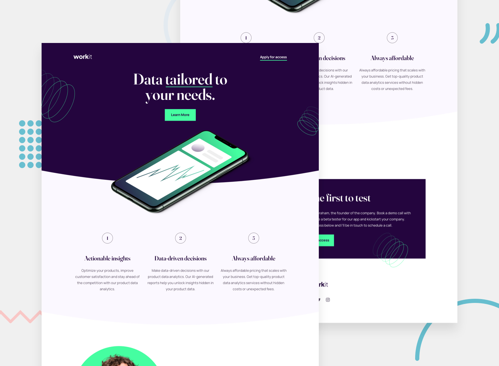

# Frontend Mentor - Workit Landing Page Solution

This is a solution to the [Workit landing page challenge on Frontend Mentor](https://www.frontendmentor.io/challenges/workit-landing-page-2fYnyle5lu). Frontend Mentor challenges help you improve your coding skills by building realistic projects.

## Table of contents

- [Overview](#overview)
  - [The challenge](#the-challenge)
  - [Screenshot](#screenshot)
  - [Links](#links)
- [My process](#my-process)
  - [Built with](#built-with)
  - [What I learned](#what-i-learned)
  - [Continued development](#continued-development)
  - [Useful resources](#useful-resources)
  - [AI Collaboration](#ai-collaboration)
- [Author](#author)

## Overview

### The challenge

Users should be able to:

- View the optimal layout for the landing page depending on their device's screen size
- See hover and focus states for all interactive elements on the page

### Screenshot



### Links

- Solution URL: [Repository](https://https://github.com/jonghwascript/workit-landing.git)
- Live Site URL: [Live site](https://jonghwascript.github.io/workit-landing)

## My process

### Built with

- Semantic HTML5 markup
- SCSS modules with `@use`
- CSS custom properties and Sass variables
- Flexbox
- CSS Grid
- Mobile-first responsive workflow
- Local font files
- Gulp, Sass, and Prettier

### What I learned

This project helped me practice responsive layout details that are easy to overlook in a landing page: decorative curves, layered background images, fluid hero artwork, and accessible section structure.

I used `clip-path` to create the curved section edges without adding extra image assets:

```scss
.hero-curve {
  clip-path: ellipse(70% 30% at 45% 51%);
}
```

I also learned that `background-clip: content-box` can exclude padding from the painted background area:

```scss
header {
  padding-bottom: 30px;
  background-clip: content-box;
}
```

For cases where only the bottom padding should be excluded from a section background, a pseudo-element is more flexible than changing the HTML structure:

```scss
.section {
  position: relative;
  padding: 40px 20px 80px;
  z-index: 1;
}

.section::before {
  content: '';
  position: absolute;
  inset: 0 0 100px;
  background-color: $solate-color-100;
  z-index: -1;
}
```

For responsive images, I used a flexible width with a maximum size and `aspect-ratio` so the browser can reserve the correct space before the image loads:

```scss
.hero-center {
  width: calc(100% - 2.5rem);
  max-width: 320px;
  height: auto;
  aspect-ratio: 320 / 184;
}
```

Another useful detail was using `em` to make an underline scale from the current text size:

```scss
.underline::after {
  width: 3.14em;
}
```

I also practiced placing multiple decorative background images on one element with comma-separated background layers:

```scss
header {
  background-image:
    url('../images/bg-pattern-1.svg'),
    url('../images/bg-pattern-2.svg');
  background-repeat: no-repeat, no-repeat;
}
```

Finally, I learned that percentages inside `transform: translate()` are based on the transformed element itself, not the viewport. When the movement should follow the viewport size, `vw`, `vh`, or `calc()` can create smoother responsive positioning.

```scss
.decorative-pattern {
  transform: translate(calc(-50% - 7vw), calc(-50% - 17vh));
}
```

### Continued development

I want to keep improving how I handle decorative assets across tablet and desktop breakpoints. In particular, I want to get more comfortable choosing between fixed pixel offsets, viewport units, percentages, and `calc()` so decorative images stay intentional instead of drifting too far as the screen grows.

I also want to continue refining accessibility details, including meaningful labels for interactive links, focus states, and hidden headings for sections that need semantic names.

### Useful resources

- [MDN - clip-path](https://developer.mozilla.org/en-US/docs/Web/CSS/clip-path) - Useful for understanding how CSS shapes can create curved section edges.
- [MDN - background-clip](https://developer.mozilla.org/en-US/docs/Web/CSS/background-clip) - Helped clarify how backgrounds are painted relative to borders, padding, and content.
- [MDN - aspect-ratio](https://developer.mozilla.org/en-US/docs/Web/CSS/aspect-ratio) - Useful for keeping responsive images stable while preserving their intended proportions.
- [MDN - transform](https://developer.mozilla.org/en-US/docs/Web/CSS/transform) - Helped clarify how percentage values behave inside transforms.

### AI Collaboration

I used ChatGPT as a learning partner while building and reviewing this project. The most helpful parts were discussing responsive CSS behavior, clarifying how layout units behave, improving semantic HTML structure, and reviewing small project metadata issues.

## Author

- Frontend Mentor - [@jonghwascript](https://www.frontendmentor.io/profile/jonghwascript)
